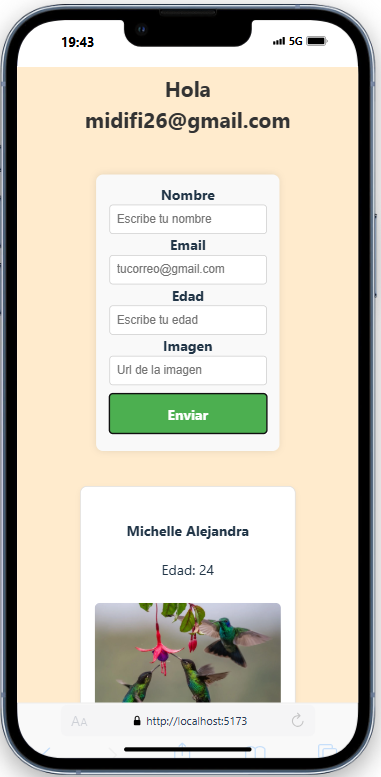

# Formulario con Comunicación entre Componentes en React

Este proyecto es una aplicación simple en React que permite crear un formulario con campos de usuario, mostrar la información ingresada y demostrar comunicación entre componentes usando props y contexto.

---

## 🧩 Estructura de Componentes

### ✅ `Head.jsx`
- Muestra el **email** del último usuario registrado.
- Se comunica con `Form` y `Card` como **componentes hermanos (siblings)**.
- Usa `useContext` para obtener el email desde un contexto global.

### ✅ `Form.jsx`
- Contiene un formulario con los siguientes campos:
  - Nombre
  - Email
  - Edad
  - URL de imagen
- Envía los datos al componente padre (`Head`) usando una función `add`.
- Limpia los inputs después de cada envío.

### ✅ `Card.jsx`
- Muestra una tarjeta por cada usuario registrado.
- Cada tarjeta incluye nombre, edad y foto si está disponible.
- Muestra un mensaje si no hay usuarios.

---

## 🧠 Comunicación entre Componentes

### `EmailContext`
- Se utiliza `React.createContext` para compartir el **email** del último usuario registrado entre componentes.
- `Head` actúa como intermediario: recibe datos del `Form` y actualiza el contexto.
- `Card` y `Form` se comunican como **hermanos (siblings)** a través del componente padre.

---


## 🚀 Cómo ejecutar este proyecto

1. Fork  y Clona el repositorio:
   ```bash
   git clone https://github.com/midifi26/proyect-sibling_sibling_context.git

2. Instala las dependencias:
    ```bash

   npm install

3. Ejecuta el servidor de desarrollo
    ```bash

    npm run dev
    Esto abrirá tu app en http://localhost:5173 (por defecto con Vite)

### Una pequeña demostracion de la vista del proyecto



